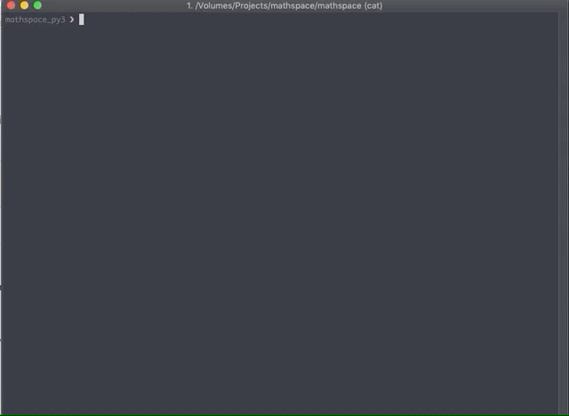
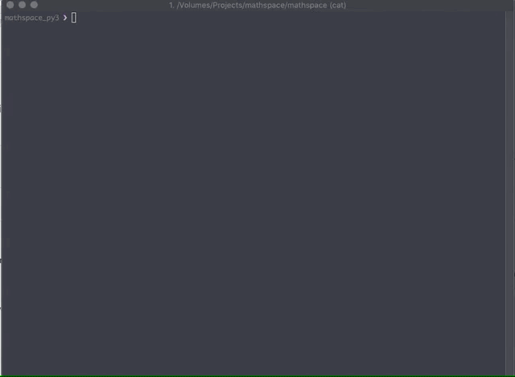
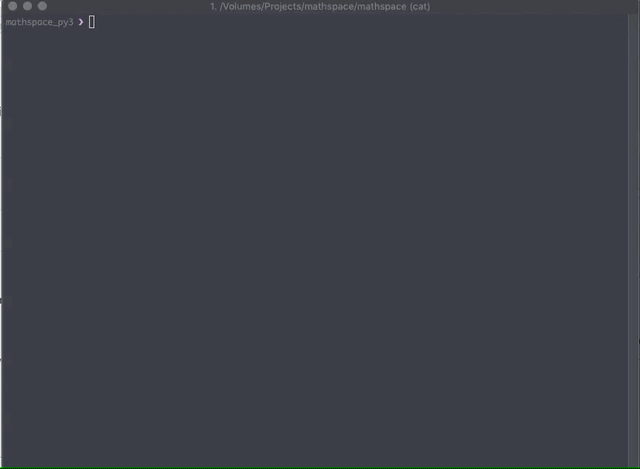
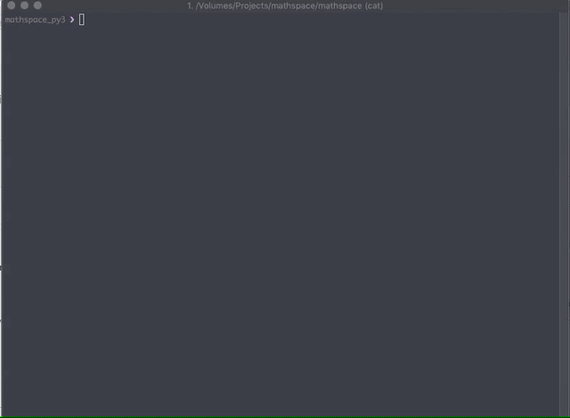

# Jira CLI 

Tiny helper cli tool that allows you to select a sprint, board, and issue to work on, be able to switch between
jira issues, and checkout branches that are named after said issues.

## Download a Binary
* MacOS - [jira](https://github.com/kvnvelasco/jira-cli/releases/download/v0.1.0/darwin-x86-jira)

## Compiling it yourself

1. Install cargo and rustc from rustup `curl --proto '=https' --tlsv1.2 -sSf https://sh.rustup.rs | sh`
2. In the project directory run `cargo install --path ./jira`

## Usage 

`jira init`

The jira cli is folder context sensitive and will search for a `.jira` directory until '/'. If it cannot find one
the cli will panic and unwind the stack. Use `jira init` to create a context in the current directory

`jira set board`

Set the current board context.

`jira set sprint`

Set the current sprint context.

`jira set issue`

Set the current issue context.

`jira checkout`

Take the current issue and kebab case the summary. Check out the branch and reset the index.

